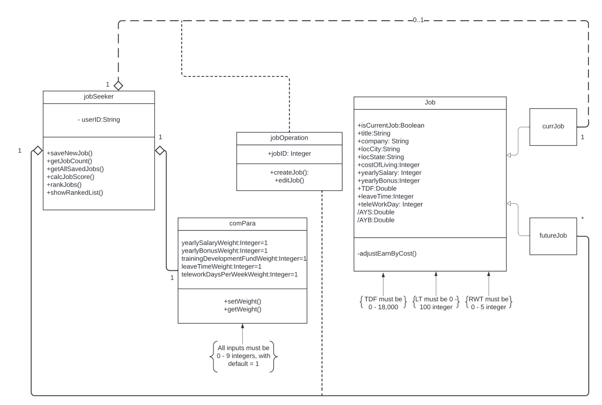
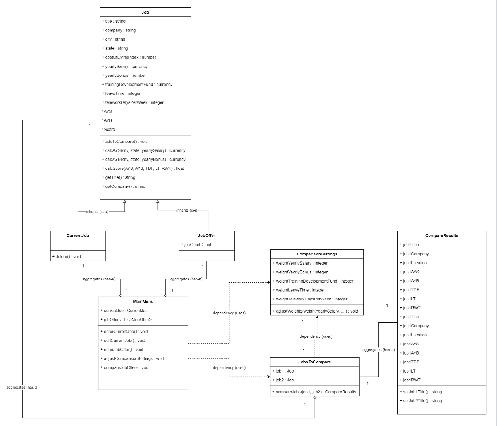
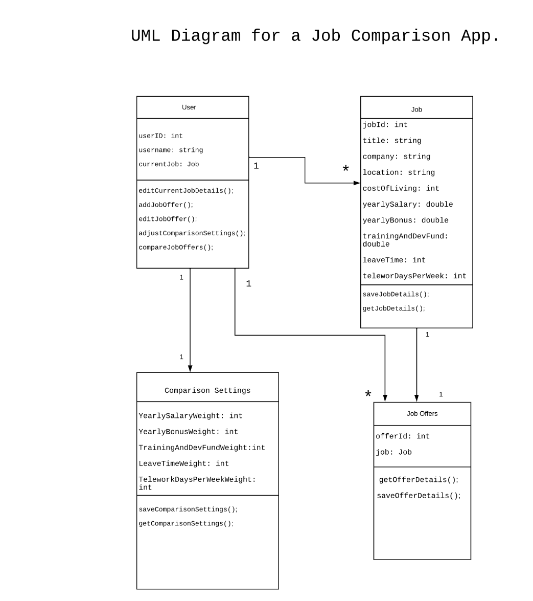
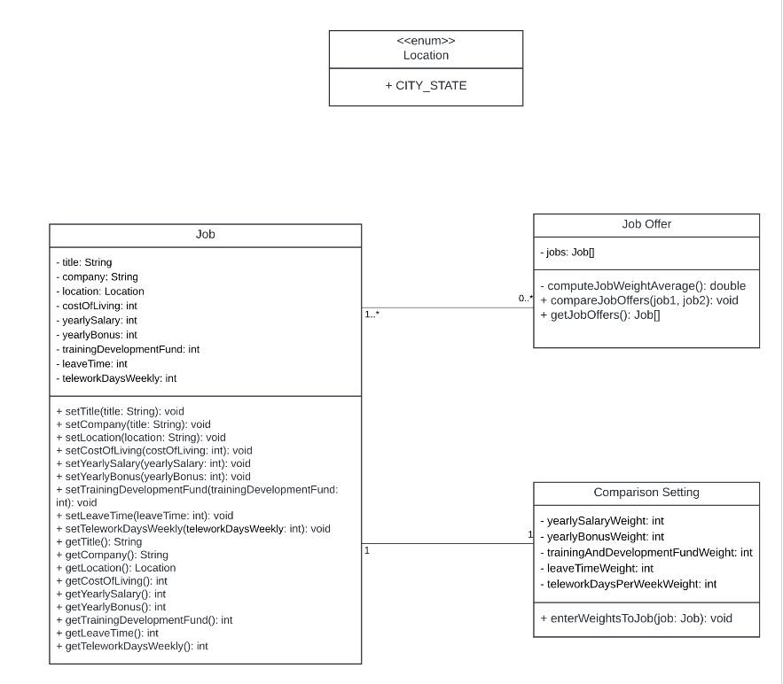
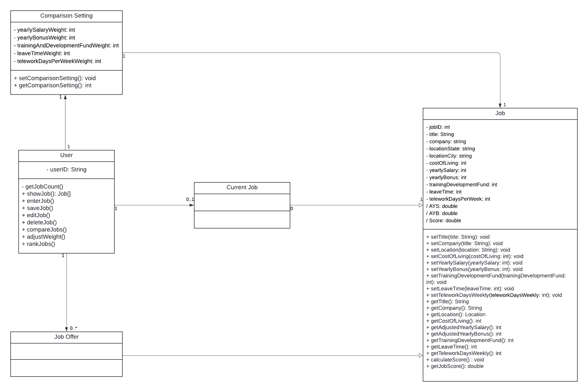

# Design Discussion - Team 047 - Summer 2024 CS6300
## Individual Designs
### Design 1 - Yunhe Cui\

- Pros: 
  - CurrentJob and FutureJob subclasses keep track of the user’s info
- Cons: 
  - should allow recalculating job score when changing comparison parameters

### Design 2 - Kartikeya Kashiva

- Pros: 
  - Derived variables for job class
  - Good use of dependencies/associations among all classes
- Cons:
  - CompareResults could be omitted because it’s purely GUI-specific
  - Need to show the relation between CompareSettings and Job classes. We need to recalculate the score every time weights are adjusted

### Design 3 - Brenda Njeri

- Pros: 
  - The well-structured design has most of the attributes and methods needed to meet the requirements
- Cons:
  - The relationship between User and Job should be 1 to 1 not 1 to many.
  - Should consider state as an attribute.

### Design 4 - Thu Nguyen

- Pros: 
  - Comparison Setting class’ relationship to Job to reflect weight assigned for each job offer.
  - Clear usage of multiplicity relationships between entities
- Cons:
  - Should consider the user-job relationship, as the number of jobs affects functionality
  - Job Offer could be a subclass of Job to inherit Job’s attributes.
  - Missing derived variables

## Team Design
### Design display

### Design discussion
The initial draft of team design was developed during team meetings. Compared to Design #1, the team design removed the 
**jobOperation** class, and added the calculated score as derived variable for the **Job** class. 
Compared to Design #2, the team design removed the **MainMenu** class as the displaying through UI is preferred in actual development. 
We retained the subclass structure mentioned in Design#1 and #2 to reflect the different relationships between the user 
and current job/ future job offers, and to ensure the "compare job" is enabled when feasible. 
The absence of subclass in design #3 and #4 are the main shortage of those individual design and the main difference between them and the team design.
Additionally, both design #3 and #4 did not include derived variables for jobs.

The team also chose to add more detailed functions than individual designs to class **Job** to better handle the requirements.
Adding those variables to the team design will make the implementation phase more efficient. 

## Summary
The team design is a culmination of the individual designs. We combined the advantages of each design, 
discussed the shortage of individual designs, while keeping the final output concise and comprehensive. 
As the project move forward, the team may adjust the design slightly to reflect the new/missing requirements.