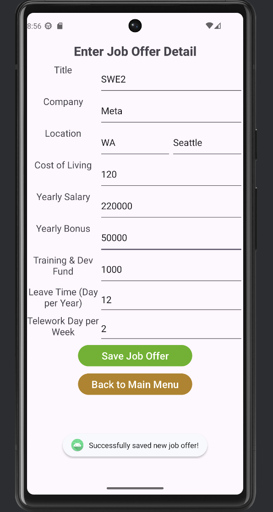

# Design Document
**Author**: Team 047

## 1 Design Considerations

### 1.1 Assumptions

* The **primary user** is George P. Burdell, an alumnus of Georgia Tech, who is looking for a new job in the US after graduation. He wants to compare the compensation and benefits of job offers and possibly current job in different locations 
* The app is for a **single-user** only with no support for account management or multi-user job comparison
* It is possible that the user has a **current job** but not mandatory
* We’re assuming the **job locations** are in the U.S. only so we only allow the user to input a U.S. State and City to reflect the **Cost of Living index**
* The user will know the corresponding **Cost of Living index** of the US city when they are entering a job offer. The app will calculate the adjusted salary using the formula AYS = (YS * 100) / INDEX, where AYS is adjusted yearly salary and YS is the yearly salary. The adjusted yearly bonus will be calculated in the similar manner.
* The user will require an **Android device of API level 33 or higher** (Android 13 Tiramisu)
* The app does need networking and **internet connectivity** as all user input jobs data is stored locally
* The app will use an SQL based **database** for data persistence or state, eg. job offers data should be preserved when app is closed and re-opened
* For best UI experience, we recommend user to use a Pixel 6 device. 

### 1.2 Constraints

*Describe any constraints on the system that have a significant impact on the design of the system.*

* Minimum SDK: Android API level 33
* Programming language: Java 17
* Build configuration: Groovy DSL (build.gradle)
* The user interface must be intuitive and responsive. Our design will be limited to default Android widgets for buttons, input text elements, etc
* Our choice of the database SQL-based vs NoSQL like MongoDB will affect how the data is stored and queried in the app. We finally decided to use **SQLite**. The DatabaseContract and SQLiteOpenHelper class impacted the design eg. ensuring that we only have one instance of the database in the app and are not re-instantiating. Due to time constrain, we are not able to migrate to Room.

### 1.3 System Environment

**Hardware:**
* Android devices (smartphones, tablets) with Android 13 Tiramisu (API level 33) or above
* Enough storage is available for installing the app and storing the job offers database and data locally input by the users

**Software:**
* For development, we’re using the Android Studio as the IDE
* We will use git and github for collaboration and flow control
* We will import the relevant Android and Java libraries for UI, validation and error handling, and database management

## 2 Architectural Design

### 2.1 Component Diagram
The component diagram lists the view, model, infrastructure and database and how they are connected.  The model includes job, job offer and comparison setting classes. 
The view includes 6 UI pages: Main menu, Enter current job details, Enter job offer details, Edit current job details, Adjust comparison weights, job to compare, and compare result/2 jobs display. 

### 2.2 Deployment Diagram

Since this is a single-user application, the deployment diagram only displays the connection between the app and JobDB database. 

## 3 Low-Level Design

### 3.1 Class Diagram
The UML diagram represents the static class structure for the component and their relationships for this application.

## 4 User Interface Design
Below are the design layout descriptions and the UI screenshots of each activity/screen in the app. 

### Main Menu
- This is the entry point of the app and the first activity that is created on launch
- This screen will have a title to show the app title "Job Offer Comparison"
- This screens will have 5 buttons to start other activities for:
    - Enter Current Job Details: disabled if current job has already been saved
    - Edit Current Job Details: disabled if no current job has been saved yet
    - Enter Job Offer Detail
    - Adjust Comparison Settings
    - Compare Job Offers: disabled if less than 2 total jobs (# of current job + # of job offer) have been saved
    

### Enter Current Job Details
- This screen will have TextView labels and EditText input fields:
    - Title (String)
    - Company (String)
    - Location: State, City (Strings)
    - Cost of Living (Integer)
    - Yearly Salary (Integer)
    - Yearly Bonus (Integer)
    - Training & Dev Fund (0 - 18,000 integer, inclusively)
    - Leave Time (Days per year, 0 - 100 integer, inclusively)
    - Telework Days per week (0 - 5 integer, inclusively)
- User can save the inputs if they align with the pre-defined requirements and will be re-directed to main menu automatically
- User will not be able to save the inputs and will be notified by the error message if the inputs do not meet the requirements
- 2 buttons:
    - Save Current Job
    - Back to Main Menu

### Edit Current Job Details
- This screen will have the same input fields as Enter Current Job Details screen
- The input fields will be pre-filled with data from the saved current job, and the user can choose to edit any field
- User can save the edit if the updated information aligns with the pre-defined requirements and will be re-directed to main menu automatically
- User will not be able to save the inputs and will be notified by the error message if the inputs do not meet the requirements
- 2 buttons:
    - Update Current Job
    - Back to Main Menu

### Enter Job Offer Detail
- This screen will have the same input fields as Enter Current Job Details screen
- User can save the inputs if they align with the pre-defined requirements and all inputs for the successfully saved job will be removed automatically
- User will not be able to save the inputs and will be notified by the error message if the inputs do not meet the requirements
- 3 buttons:
    - Save Job Offer
    - Compare Saved Offer
    - Back to Main Menu

### Adjust Comparison Settings
- This screen will have 5 EditText input fields to take integer values as weights for:
    - Yearly Salary (Non-negative integer, default = 1)
    - Yearly Bonus (Non-negative integer, default = 1)
    - Training & Dev Fund (Non-negative integer, default = 1)
    - Leave Time (Day per year) (Non-negative integer, default = 1)
    - Telework Days per week (Non-negative integer, default = 1)
- These fields should be pre-filled with the saved weights in the ComparisonSetting db table. If no weights saved previously, show default values of 1
- User can save the inputs if they align with the pre-defined requirements
- 2 buttons:
    - Save Weights
    - Back to Main Menu

### Compare Job Offers
- This screen will have a tabular layout to show all the saved jobs with these columns:
     - Rank: sorted descending based on weighted job score
     - Title
     - Company
     - Selected : checkbox
- Button compare offers will be disabled if there are not exactly 2 jobs are selected
- Checkboxes will be disabled if there are 2 boxes selected. User is allowed to de-selected and re-select other jobs in the list.
- 2 buttons:
    - Compare Offers
    - Back to Main Menu

### Display 2 Job Offers
- This screen displays the 2 selected jobs' details side-by-side for an easy comparison in 2 columns. Their attributes to compare are shown in rows, including:
  - Title
  - Company
  - Location
  - Cost of living index
  - Yearly Salary
  - Yearly Bonus
  - Training/Dev Fund
  - Leave Time
  - Telework Days per Week
- Compare Another Offer will direct user back to the list view of offers in the **Compare Job Offers** page
- 2 Buttons:
  - Compare Another Offer
  - Back to Main Menu
  
