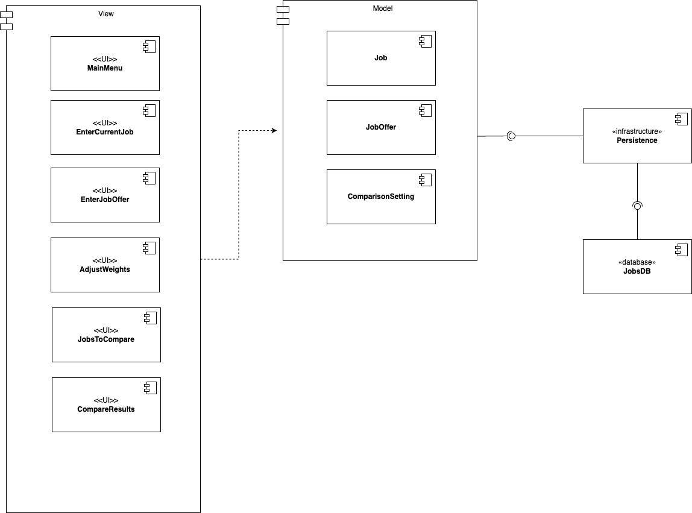
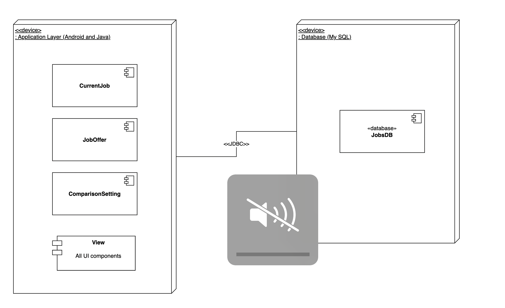
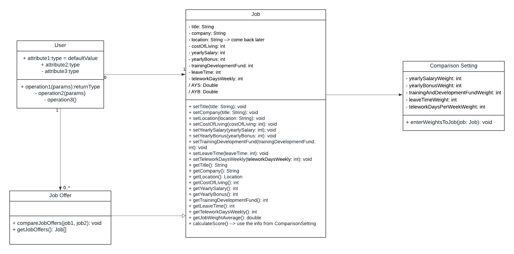
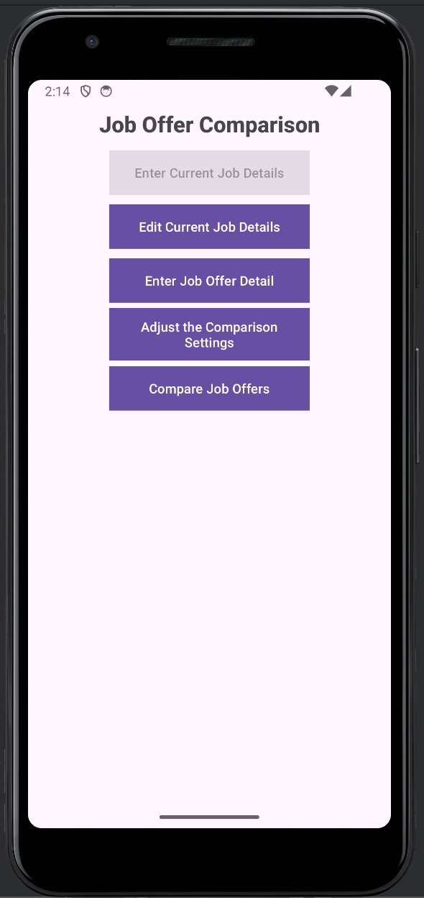
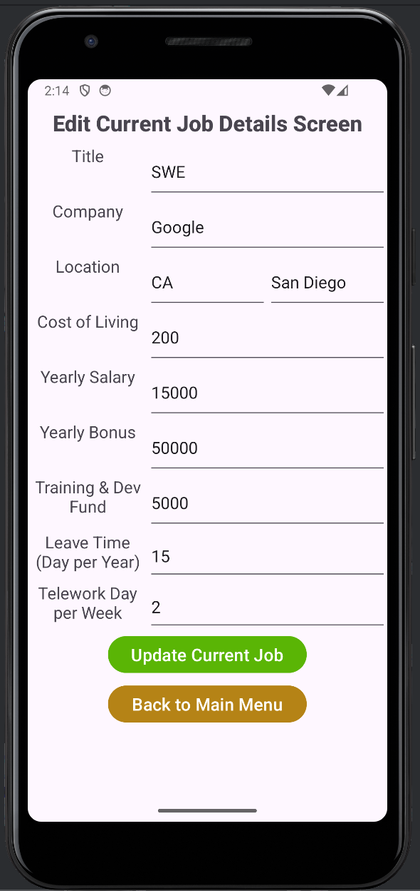
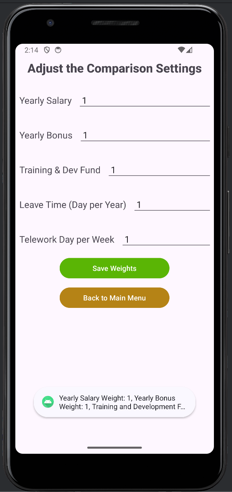
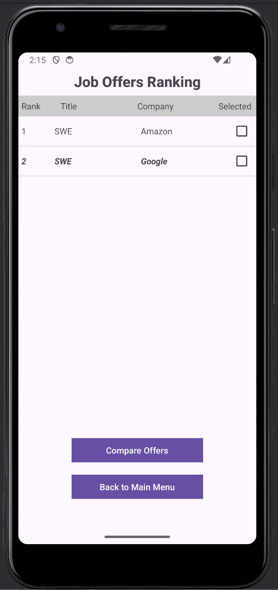

# Design Document

*This is the template for your design document. The parts in italics are concise explanations of what should go in the corresponding sections and should not appear in the final document.*

**Author**: Team 047

## 1 Design Considerations

*The subsections below describe the issues that need to be addressed or resolved prior to or while completing the design, as well as issues that may influence the design process.*

### 1.1 Assumptions

*Describe any assumption, background, or dependencies of the software, its use, the operational environment, or significant project issues.*

* The **primary user** is George P. Burdell, an alumnus of Georgia Tech, who is looking for a new job in the US after graduation. He wants to compare job offers and benefits in different locations 
* The app is for a **single-user** only with no support for account management or multi-user job comparison
* It is possible that the user has a **current job** but not mandatory
* We’re assuming the **job locations** are in the US only so we only need the user to input a US State and City to calculate the Cost of Living index
* The user will know the correct **Cost of Living index** of the US city they’re entering in a job offer. The app will calculate the adjusted salary and bonus using the formula AYS = (YS * 100) / INDEX, where AYS is adjusted yearly salary and YS is the yearly salary
* The user will be using an **Android device of API level 33 or higher** (Android 13 Tiramisu)
* The app does need networking and **internet connectivity** as all user input jobs data is stored locally
* The app will use an SQL based **database** for data persistence or state, eg. job offers data should be preserved when app is closed and re-opened

### 1.2 Constraints

*Describe any constraints on the system that have a significant impact on the design of the system.*

* Minimum SDK: Android API level 33
* Programming language: Java 17
* Build configuration: Groovy DSL (build.gradle)
* The user interface must be intuitive and responsive. Our design will be limited to default Android widgets for buttons, input text elements, etc
* Our choice of the database SQL-based vs NoSQL like MongoDB will affect how the data is stored and queried in the app. We finally decided to use **SQLite**. The DatabaseContract and SQLiteOpenHelper class impacted the design eg. ensuring that we only have one instance of the database in the app and are not re-instantiating. Later we might consider migrating to Room

### 1.3 System Environment

*Describe the hardware and software that the system must operate in and interact with.*

**Hardware:**
* Android devices (smartphones, tablets) with min Android 13 Tiramisu (API level 33)
* Enough storage available for installing the app and storing the job offers data locally input by the users

**Software:**
* For development we’re using the Android Studio as the IDE
* We’ll be importing the relevant Android and Java libraries for UI, validation and error handling, database management

## 2 Architectural Design

*The architecture provides the high-level design view of a system and provides a basis for more detailed design work. These subsections describe the top-level components of the system you are building and their relationships.*

### 2.1 Component Diagram

*This section should provide and describe a diagram that shows the various components and how they are connected. This diagram shows the logical/functional components of the system, where each component represents a cluster of related functionality. In the case of simple systems, where there is a single component, this diagram may be unnecessary; in these cases, simply state so and concisely state why.*

### 2.2 Deployment Diagram

*This section should describe how the different components will be deployed on actual hardware devices. Similar to the previous subsection, this diagram may be unnecessary for simple systems; in these cases, simply state so and concisely state why.*

## 3 Low-Level Design

*Describe the low-level design for each of the system components identified in the previous section. For each component, you should provide details in the following UML diagrams to show its internal structure.*

### 3.1 Class Diagram

*In the case of an OO design, the internal structure of a software component would typically be expressed as a UML class diagram that represents the static class structure for the component and their relationships.*

### 3.2 Other Diagrams

*<u>Optionally</u>, you can decide to describe some dynamic aspects of your system using one or more behavioral diagrams, such as sequence and state diagrams.*

## 4 User Interface Design
*For GUI-based systems, this section should provide the specific format/layout of the user interface of the system (e.g., in the form of graphical mockups).*

Below are the design layout description and the beta version UI screenshots of each activity/screen in the app

### Main Menu
- This is the entry point of the app and the first activity that is created on launch
- This screen will have a title to show the app title "Job Offer Comparison"
- This screens will have 5 buttons to start other activities for:
    - Enter Current Job Details: disabled if current job already saved
    - Edit Current Job Details: disabled if no current job saved yet
    - Enter Job Offer Detail
    - Adjust Comparison Settings
    - Compare Job Offers: disabled if less than 2 total jobs saved
    

### Enter Current Job Details
- This screen will have TextView labels and EditText input fields:
    - Title
    - Company
    - Location
    - Cost of Living
    - Yearly Salary
    - Yearly Bonus
    - Training & Dev Fund
    - Leave Time (days per year)
    - Telework Days per week
- 2 buttons:
    - Save Current Job
    - Back to Main Menu

### Edit Current Job Details
- This screen will have the same input fields as Enter Current Job Details screen
- The input fields will be pre-filled with data from the saved current job, and the user can choose to edit any field
- 2 buttons:
    - Update Current Job
    - Back to Main Menu

### Enter Job Offer Detail
- This screen will have the same input fields as Enter Current Job Details screen
- 2 buttons:
    - Save Job Offer
    - Back to Main Menu

### Adjust Comparison Settings
- This screen will have 5 EditText input fields to take integer values as weights for:
    - Yearly Salary
    - Yearly Bonus
    - Training & Dev Fund
    - Leave Time (Day per year)
    - Telework Days per week
- These fields should be pre-filled with the saved weights in the ComparisonSetting db table. If no weights saved previously, show default value of 1
- 2 buttons:
    - Save Weights
    - Back to Main Menu

### Compare Job Offers
- This screen will have a tabluar layout to show all the saved jobs with these columns:
     - Rank : sorter based on score
     - Title
     - Company
     - Selected : checkbox
- 2 buttons:
    - Compare Offers
    - Back to Main Menu

