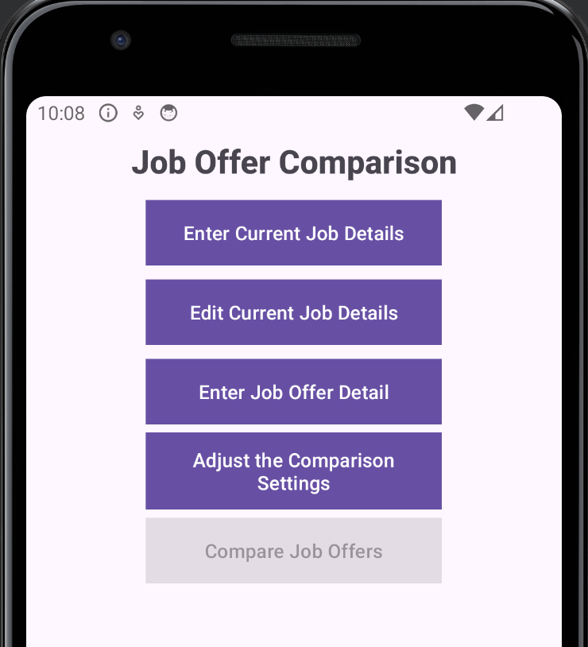
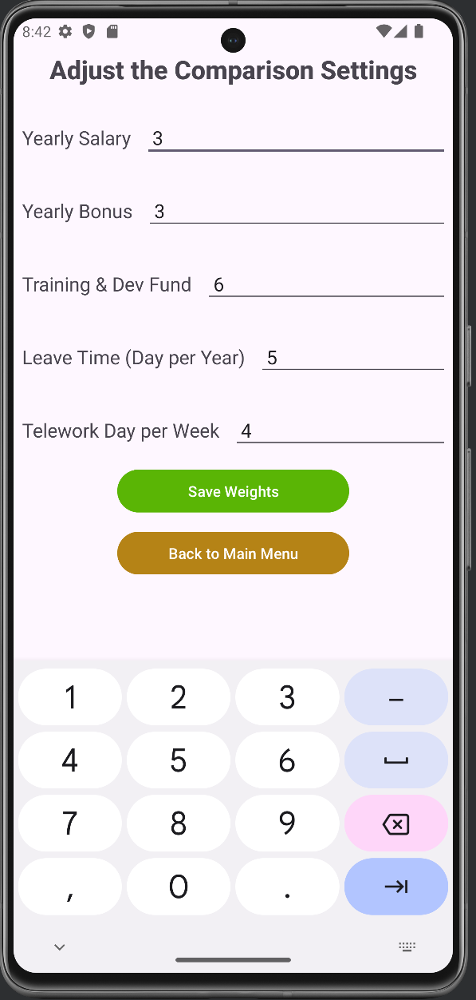
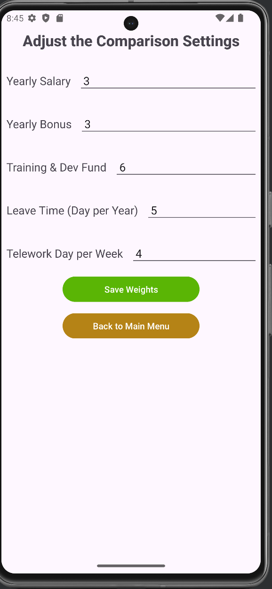
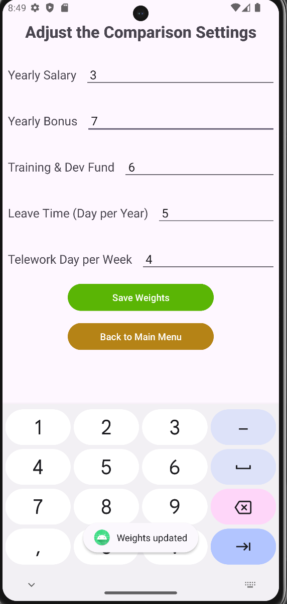

# Test Plan

**Author**: Team 047.

## 1 Testing Strategy

### 1.1 Overall strategy
#### Objective
The objective of the test plan is to ensure that the JobComparison application meets all the specified requirements.

#### Scope
- In-Scope - The features and functionalities of the system.
- Out-Of-Scope - The hardware used such as mobile phone or laptop.

#### Strategy
We will write tests to cover the different sections of code. 
The test cases will be written for each functionality once its development is done.
We will then use the JUNIT testing framework to validate that our test cases succeed.
We will then conduct manual tests such as usability and acceptance tests to ensure that the application meets all requirements.

#### Assumptions
- The development team will provide stable builds for testing.

#### Risks and Mitigation
- Risk: The project has tight deadlines.
- Mitigation: Prioritize critical tests and write test cases after developing each feature.

### 1.2 Test Selection
For our Test selection, we will use both the Black-box and White-box techniques for testing.

#### White-Box Testing:
White-box testing involves testing the internal structures and working of the application.
For this we will use the below:
- Unit Testing: Automated Tests with JUnit to verify that the individual units of code work as expected.
- Integration Testing: Automated Tests with JUnit to verify that the different modules in the application work together.

#### Black-Box Testing:
This testing involves testing the funtionality of the appliiction without looking at internal code.
For this we will use the below:
- Acceptance Testing: Manual tests to verify that the application meets business requirements and is ready for delivery.
- Usability Testing: Manual tests to ensure that the applicaton is user-friendly and meets user experience expectations.

For the Automated tests, the test cases for each functionality will be implemented by the developer handling a specific functionality.
For the Manual tests, all members of the team will be involved with the testing.

### 1.3 Adequacy Criterion
To assess the quality of our test cases, we will use the Test metrics below:
- Test Coverage: Ensure that at least 70% of our application code is tested.
- Pass Rate: Ensure a pass rate of at least 95% for each of our test cases.

### 1.4 Bug Tracking
Whenever a bug is filed, the owner of the section of code where the bug is will be required to resolve and close the bug.
Incase of any enhancement requests, the developer working on that feature will implement 

### 1.5 Technology
The Technology that we will use for most of our automated tests will be JUNIT.
Others will be determined as we continue with the development.

## 2 Test Cases
For this deliverable, we attempt manual testing to test the app's functionality.

#### Compare Job Offers

- **Test case 1**: show a table of ranking of job offers with no current job 
  - Manual Steps:
    - Enter 3 job offers via Enter Job Offers button.
    -From main menu, selects Compare Job Offers.
  - Expected Result:
    - A table of 3 job offers with ranking from high to low.
    - No entry is indicated as current job.
  - Actual Result:
    - Show picture here

- **Test case 2**: show a table of ranking of job offers with current job 
  - Manual Steps:
    - Enter 3 job offers via Enter Job Offers button.
    - Enter a current job via Enter Current Job Details button.
    - From main menu, selects Compare Job Offers.
  - Expected Result:
    - A table of 4 job offers with ranking from high to low.
    - The current job entry is marked bold and italic to indicate as current job.
  - Actual Result:
    - Show picture here

- **Test case 3**: Compare Job Offers button is disabled when no job offer exists.
  - Manual Steps:
    - From main menu, selects Compare Job Offers.
  - Expected Result:
    - The button is disabled.
  - Actual Result:
    

- **Test case 4**: Select 2 offers and compare
  - Manual Steps:
    - TODO
  - Expected Result:
    - TODO
  - Actual Result:

- **Test case 5**: Verify that Input for comparison settings are integers.
  - Manual Steps:
    - From main menu, select Adjust comparison settings.
    - Select any edittext to input a weight.
  - Expected Result:
    - The keyboard that appears to input values is a numbers-only keyboard.
  - Actual Result:
    

- **Test case 6**: Retrive and show the existing comparison settings.
  - Manual Steps:
    - From main menu, select Adjust comparison settings.
  - Expected Result:
    - The comparison settings screen shows the currently saved weights for each setting.
  - Actual Result:
    

- **Test case 7**: Update the yearly bonus weight to 7.
  - Manual Steps:
    - From main menu, select Adjust comparison settings.
    - In the comparison settings screen, select the yearly bonus text and change the value to 7.
    - Click on the Save Weights Button.
  - Expected Result:
    - The comparison settings screen shows weight for yearly bonus as 7.
    - A toast message showing Weights updated is displayed at the botton of the screen.
  - Actual Result:
    

TODO: template - feel free to remove this below

| Test Case Step to perform:  | Expected Result  | Actual Result  | Pass/Fail Information:  | 
|-----------|-----------|-----------|-----------|
| User Enters current job details | Current Job details successfully saved |  |  |
| User fails to enter one field in the current job details | An error is given showing input is empty |  |  |
| User Edits/Updates current job details | Updated current Job details successfully saved |  |  |
| User enters an incorrect datatype input field in the edit current job details | An error is given showing given field is invalid |  |  |
| User Enters job offer details |  Job offer details successfully saved |  |  |
| User inputs an invalid value in one field of job offer details |  An error is given showing input is invalid |  |  |
| User Inputs comparison settings |  Comparison settings successfully saved |  |  |
| User inputs an invalid weight in one field of comparison settings |  An error is given showing input is invalid |  |  |
| User edits/updates comparison settings |  Comparison settings successfully updated saved |  |  |
| User retrieves the current job details |  Current Job is retrieved and successfully returned |  |  |
| User retrieves the comparison settings | Comparison settings are retrieved and successfully returned |  |  |
