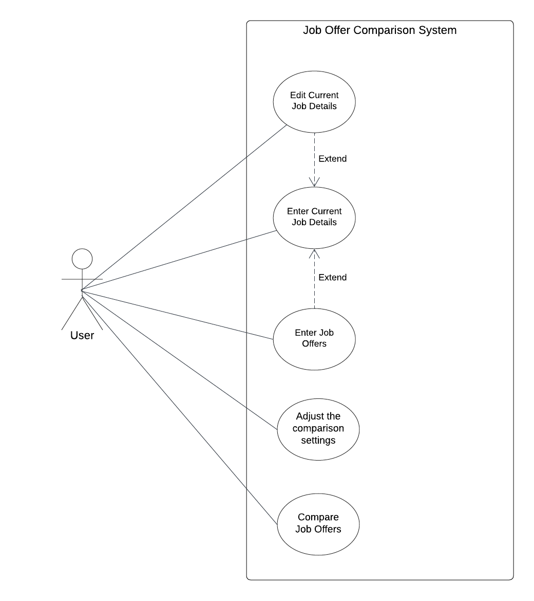
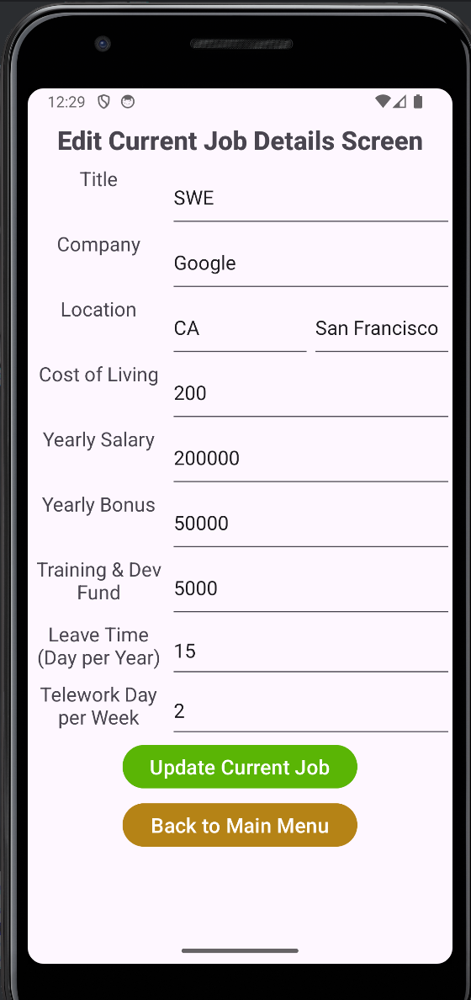
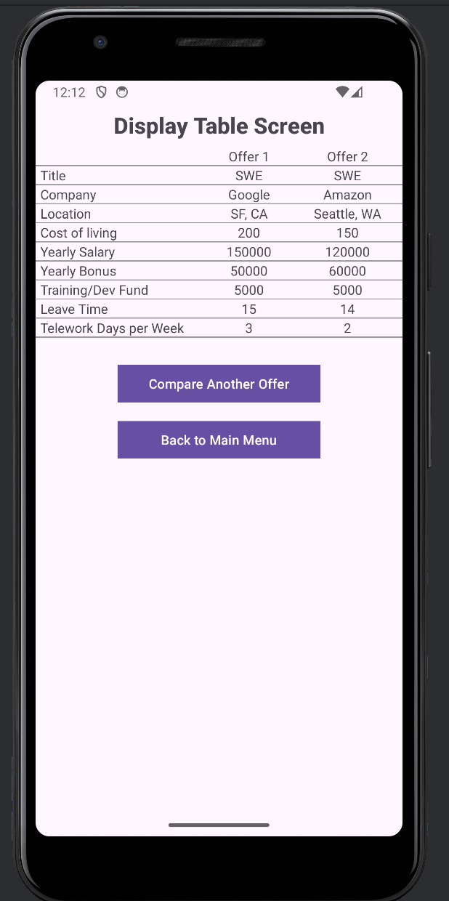

# Job Offer Comparison App

Android application that allows users to **compare job offers across multiple dimensions** such as salary, bonus, benefits, cost of living, and work flexibility. The app ranks job opportunities using configurable weights so users can objectively evaluate competing offers.

This project was developed as part of **CS6300: Software Development Process** in the **Georgia Tech OMSCS program**.

---

# Overview

Choosing between multiple job offers can be difficult when compensation packages vary across salary, bonuses, benefits, and location. This application helps users make better decisions by:

- Storing their **current job and multiple job offers**
- Adjusting for **cost of living differences**
- Assigning **custom weights to compensation components**
- Calculating a **weighted job score**
- Ranking and comparing job opportunities side-by-side

The application runs locally on Android and stores data in a local SQLite database.

---

# Features

## Job Management

- Enter and store **current job details**
- Add **multiple job offers**
- Edit existing job information
- Persist job data locally using SQLite

## Job Comparison

- Automatically calculate a **weighted job score**
- Rank jobs based on compensation and benefits
- Select **two jobs to compare side-by-side**

## Adjustable Comparison Settings

Users can customize importance weights for:

- Yearly salary
- Yearly bonus
- Training & development fund
- Leave time
- Telework days per week

## Cost of Living Adjustment

Compensation values are normalized using a cost-of-living index.

Adjusted Yearly Salary:
```
AYS = (YearlySalary * 100) / CostOfLivingIndex
```
Adjusted yearly bonus uses the same formula.

---

# Tech Stack

| Component | Technology |
|---|---|
| Platform | Android |
| Language | Java 17 |
| IDE | Android Studio |
| Database | SQLite |
| Build System | Gradle (Groovy DSL) |
| Testing | JUnit |

Minimum supported Android version: **API Level 33 (Android 13)**.

---

# Application Architecture

The system follows a **layered architecture** separating UI, domain models, and persistence.

### Main Components

**View Layer**
- Android activities and UI components

**Model Layer**
- `Job`
- `JobOffer`
- `ComparisonSetting`

**Persistence Layer**
- SQLite database
- Database helper classes

The application stores all job data locally and does not require internet connectivity.

---

# System Diagrams

## Use Case Diagram



Shows the primary user interactions including entering jobs, adjusting comparison settings, and comparing offers.

---

## Component Architecture


The system separates UI components, business logic models, and database persistence.

---

## Class Diagram


Represents the static structure of the core classes and their relationships.

---

## Deployment Diagram


Since this is a single-user application, the Android app connects to a local SQLite database.

---

# User Interface Design
Below are the design layout descriptions and the UI screenshots of each activity/screen in the app. 

## Main Menu
- This is the entry point of the app and the first activity that is created on launch
- This screen will have a title to show the app title "Job Offer Comparison"
- This screens will have 5 buttons to start other activities for:
    - Enter Current Job Details: disabled if current job has already been saved
    - Edit Current Job Details: disabled if no current job has been saved yet
    - Enter Job Offer Detail
    - Adjust Comparison Settings
    - Compare Job Offers: disabled if less than 2 total jobs (# of current job + # of job offer) have been saved
    


## Enter Current Job Details
- This screen will have TextView labels and EditText input fields:
    - Title (String)
    - Company (String)
    - Location: State, City (Strings)
    - Cost of Living (Integer)
    - Yearly Salary (Integer)
    - Yearly Bonus (Integer)
    - Training & Dev Fund (0 - 18,000 integer, inclusively)
    - Leave Time (Days per year, 0 - 100 integer, inclusively)
    - Telework Days per week (0 - 5 integer, inclusively)
- User can save the inputs if they align with the pre-defined requirements and will be re-directed to main menu automatically
- User will not be able to save the inputs and will be notified by the error message if the inputs do not meet the requirements
- 2 buttons:
    - Save Current Job
    - Back to Main Menu


## Edit Current Job Details
- This screen will have the same input fields as Enter Current Job Details screen
- The input fields will be pre-filled with data from the saved current job, and the user can choose to edit any field
- User can save the edit if the updated information aligns with the pre-defined requirements and will be re-directed to main menu automatically
- User will not be able to save the inputs and will be notified by the error message if the inputs do not meet the requirements
- 2 buttons:
    - Update Current Job
    - Back to Main Menu

## Enter Job Offer Detail
- This screen will have the same input fields as Enter Current Job Details screen
- User can save the inputs if they align with the pre-defined requirements and all inputs for the successfully saved job will be removed automatically
- User will not be able to save the inputs and will be notified by the error message if the inputs do not meet the requirements
- 3 buttons:
    - Save Job Offer
    - Compare Saved Offer
    - Back to Main Menu

## Adjust Comparison Settings
- This screen will have 5 EditText input fields to take integer values as weights for:
    - Yearly Salary (Non-negative integer, default = 1)
    - Yearly Bonus (Non-negative integer, default = 1)
    - Training & Dev Fund (Non-negative integer, default = 1)
    - Leave Time (Day per year) (Non-negative integer, default = 1)
    - Telework Days per week (Non-negative integer, default = 1)
- These fields should be pre-filled with the saved weights in the ComparisonSetting db table. If no weights saved previously, show default values of 1
- User can save the inputs if they align with the pre-defined requirements
- 2 buttons:
    - Save Weights
    - Back to Main Menu


## Compare Job Offers
- This screen will have a tabular layout to show all the saved jobs with these columns:
     - Rank: sorted descending based on weighted job score
     - Title
     - Company
     - Selected : checkbox
- Button compare offers will be disabled if there are not exactly 2 jobs are selected
- Checkboxes will be disabled if there are 2 boxes selected. User is allowed to de-selected and re-select other jobs in the list.
- 2 buttons:
    - Compare Offers
    - Back to Main Menu


## Display 2 Job Offers
- This screen displays the 2 selected jobs' details side-by-side for an easy comparison in 2 columns. Their attributes to compare are shown in rows, including:
  - Title
  - Company
  - Location
  - Cost of living index
  - Yearly Salary
  - Yearly Bonus
  - Training/Dev Fund
  - Leave Time
  - Telework Days per Week
- Compare Another Offer will direct user back to the list view of offers in the **Compare Job Offers** page
- 2 Buttons:
  - Compare Another Offer
  - Back to Main Menu
  

---

# Testing

Testing was performed using both automated and manual approaches.

## Automated Testing

JUnit tests validate core logic such as the job score calculation.

Example input parameters:

- Adjusted salary
- Adjusted bonus
- Training fund
- Leave time
- Telework days
- Weight parameters

Expected output:

Correct weighted job score.

## Manual Testing

Manual tests verified:

- UI workflows
- Database persistence
- Input validation
- Job ranking behavior
- Comparison screen functionality

Target metrics:

- ≥70% code coverage
- ≥95% test case pass rate

---

# Development Process

The project followed a structured development lifecycle.

1. Planning
2. Architecture and design
3. Implementation
4. Testing

Key deliverables included UML diagrams, architecture documentation, working Android application, and test plans.

---

# Project Team

**CS6300 – Software Development Process**  
Georgia Institute of Technology (OMSCS)

Team 047

- Thu Nguyen
- Yunhe Cui
- Kartikeya Kashiva
- Brenda Njeri

---

# Running the Project

## Requirements

- Android Studio
- Android SDK API Level 33+
- Java 17

## Setup

Clone the repository:

```bash
git clone https://github.com/<your-username>/<repo-name>.git
```

Open the project in Android Studio and run it using either:
- Android emulator
- Android device running API 33+
